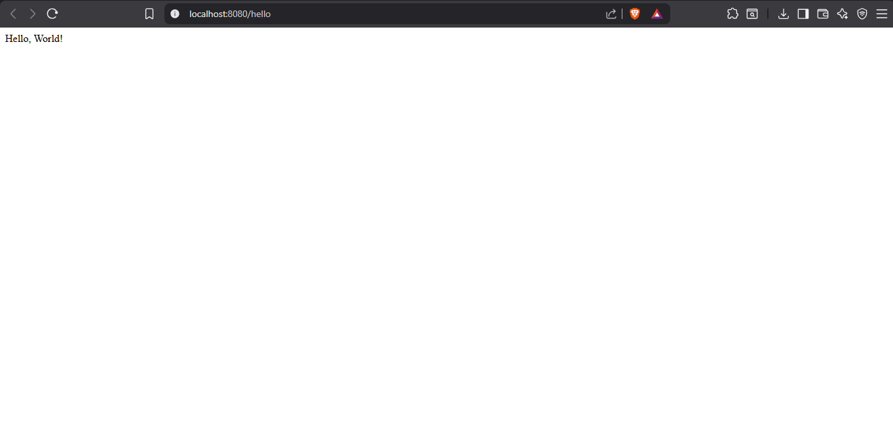
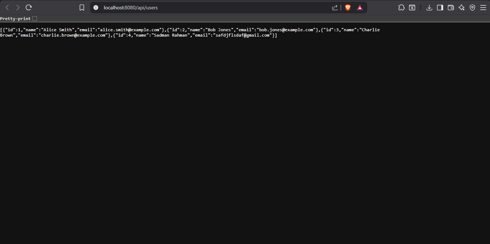

# 🌱 Spring Boot + PostgreSQL Demo

A beginner-friendly Spring Boot REST API project built as part of an internship learning journey.  
This project demonstrates a full backend setup — connecting a Java application to a real PostgreSQL database, exposing REST endpoints, and rendering a web UI using Thymeleaf.

---

## 📸 Screenshots

### Hello World Endpoint (`/hello`)


### Users REST API (`/api/users`)


---

## 🚀 Features

- ✅ **Hello World** endpoint to verify the server is running
- ✅ **Full CRUD REST API** for User management
- ✅ **PostgreSQL** database integration via Spring Data JPA
- ✅ **Thymeleaf** web UI served at the root `/`
- ✅ **Auto-seeding** — sample users are inserted on first run
- ✅ **JPA auto-schema** — database table is created/updated automatically

---

## 🛠️ Tech Stack

| Technology        | Version  | Purpose                          |
|-------------------|----------|----------------------------------|
| Java              | 17       | Core programming language        |
| Spring Boot       | 3.3.2    | Application framework            |
| Spring Data JPA   | (Boot)   | Database ORM / Repository layer  |
| Hibernate         | (Boot)   | JPA implementation               |
| PostgreSQL        | 15+      | Relational database              |
| Thymeleaf         | (Boot)   | Server-side HTML templating      |
| Maven             | 3.9.9    | Build and dependency management  |

---

## 📁 Project Structure

```
src/
└── main/
    ├── java/com/example/demo/
    │   ├── DemoApplication.java          # Main entry point
    │   ├── controller/
    │   │   ├── HomeController.java       # Serves the Thymeleaf web UI at /
    │   │   └── UserController.java       # REST API endpoints at /api/users
    │   ├── model/
    │   │   └── User.java                 # JPA Entity (maps to "users" table)
    │   └── repository/
    │       └── UserRepository.java       # JpaRepository for DB operations
    └── resources/
        ├── application.properties        # DB config and server settings
        └── templates/
            └── index.html                # Thymeleaf dashboard UI
```

---

## ⚙️ Prerequisites

Make sure you have these installed before running the project:

- **Java 17** or higher
- **Maven 3.6+**
- **PostgreSQL 12+** (running locally)

---

## 🗄️ Database Setup

1. Open **pgAdmin** or the **psql** terminal
2. Create the database:

```sql
CREATE DATABASE intern_demo;
```

3. Update `src/main/resources/application.properties` with your credentials:

```properties
spring.datasource.url=jdbc:postgresql://localhost:5432/intern_demo
spring.datasource.username=your_username
spring.datasource.password=your_password
spring.jpa.hibernate.ddl-auto=update
```

> **Note:** `ddl-auto=update` means Hibernate will automatically create/update the `users` table on startup. You don't need to write any SQL manually!

---

## ▶️ How to Run

**Clone the repository:**
```bash
git clone https://github.com/SadmanRahman12/Hello-World.git
cd Hello-World
```

**Run the application:**
```bash
mvn spring-boot:run
```

The server starts at **http://localhost:8080**

---

## 🔗 API Endpoints

| Method   | URL                   | Description              |
|----------|-----------------------|--------------------------|
| `GET`    | `/hello`              | Returns "Hello, World!"  |
| `GET`    | `/api/users`          | Get all users            |
| `GET`    | `/api/users/{id}`     | Get a user by ID         |
| `POST`   | `/api/users`          | Create a new user        |
| `PUT`    | `/api/users/{id}`     | Update an existing user  |
| `DELETE` | `/api/users/{id}`     | Delete a user            |

### Example: Create a User (POST)

```bash
curl -X POST http://localhost:8080/api/users \
  -H "Content-Type: application/json" \
  -d '{"name": "Sadman Rahman", "email": "sadman@example.com"}'
```

### Example Response

```json
{
  "id": 1,
  "name": "Sadman Rahman",
  "email": "sadman@example.com"
}
```

---

## 🧠 Key Learnings

- **Why `@Table(name = "users")`?**  
  `user` is a **reserved keyword** in PostgreSQL. Without this annotation, Hibernate would try to create a table named `user` and the SQL query would fail. Always check for reserved words when naming entities!

- **Spring Data JPA Magic:**  
  By extending `JpaRepository<User, Long>`, you get `save()`, `findAll()`, `findById()`, `delete()` — all without writing a single SQL query.

- **`@PostConstruct` for seeding:**  
  The `seedInitialData()` method in `UserController` runs automatically after the bean is created, inserting sample data only if the database is empty.

- **`ddl-auto=update`:**  
  Hibernate reads your `@Entity` class and automatically syncs the database schema. Great for development — but in production, use **Flyway or Liquibase** for controlled migrations.

---

## 👨‍💻 Author

**Sadman Rahman**  
GitHub: [@SadmanRahman12](https://github.com/SadmanRahman12)

---

## 📄 License

This project is for educational purposes as part of an internship program.
